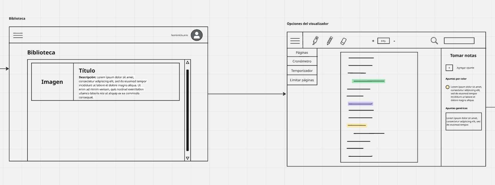
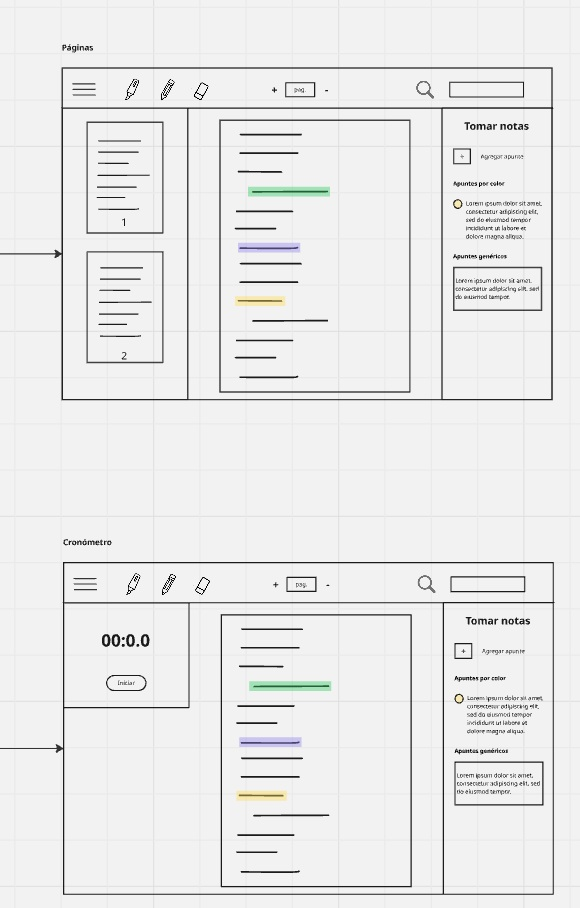

# Gestor de Libros PDF — Lectura Activa (gestor-lector-libros-pdf-frontend)

**One-liner:** Aplicación cliente para gestionar y leer PDFs personales con subrayados, apuntes y control de sesiones de lectura.  
**Estado:** WIP — Commit inicial (MVP en desarrollo).

---

## Índice
- [Introducción](#introducción)
- [Flujo de la aplicación](#Flujo-de-la-aplicación)
- [Requisitos](#requisitos)

---

## Introducción
Este proyecto es el frontend del **Gestor de Libros PDF — Lectura Activa**.  
Permite al usuario subir PDFs, leerlos en la aplicación, subrayar textos, crear apuntes vinculados a subrayados y registrar sesiones de lectura con temporizador y límites de páginas.

El propósito actual es construir un MVP que demuestre la lógica de lectura activa y la interacción con la API (autenticación, subida de archivos, subrayados y sesiones).

---

# Flujo de la aplicación — User flows

A continuación se muestran los wireframes / flujos principales de la aplicación.  
(Coloca las imágenes en `docs/flows/` o ajusta las rutas si las guardas en otra carpeta.)

---

## 1) Biblioteca → Visualizador de PDFs

  

**Descripción:**  
1. El usuario accede a su biblioteca personal.  
2. Selecciona un libro para abrirlo en el visualizador.  
3. Desde el visualizador puede navegar páginas y acceder a herramientas de subrayado y notas.

---

## 2) Login → Registro → Menú principal

  

**Descripción:**  
1. Pantalla de inicio con opción de login o registro.  
2. Registro simple (email, contraseña) o login con credenciales.  
3. Tras autenticarse, se muestra el menú principal con acceso a Biblioteca, Importar, Perfil, etc.

---

## 3) Menú principal → Importar libro → Historial

  

**Descripción:**  
1. Desde el menú principal el usuario elige importar un nuevo PDF.  
2. Interfaz de subida con metadatos (título, autor, género).  
3. El historial muestra libros recientemente leídos y sesiones pasadas.

---

## 4) Visualizador de PDFs → Páginas → Cronómetro

  

**Descripción:**  
1. Panel del visualizador con miniaturas de páginas y barra de navegación.  
2. Herramienta de cronómetro para medir tiempo de sesión en vivo.  
3. Los tiempos se registran en el historial de sesiones al finalizar.

---

## 5) Visualizador de PDFs → Temporizador → Limitar páginas

  

**Descripción:**  
1. Configuración de un temporizador para una sesión concreta (ej. 30 minutos).  
2. Opciones para limitar el número de páginas por sesión (inicio / fin / máximo).  
3. Alertas visuales o sonoras al cumplirse el tiempo o las páginas objetivo.

---
---

## Requisitos
- Java 11+ / Maven 3.x **o** Node 14+ (depende del stack; actualiza según corresponda)  
- PostgreSQL (opcional para desarrollo)  
- Git (y SSH configurado para push)

---
